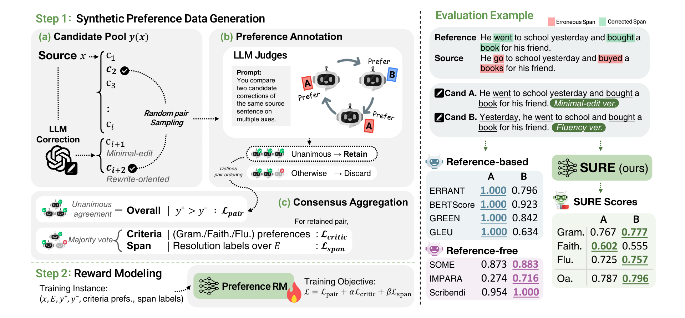

# Don’t Count the Edits, Judge by the Outcome Alone: Reward-Based Evaluation for Grammatical Error Correction

[](https://arxiv.org/abs/2609.15559)
[](https://huggingface.co/hayeonggg/SURE)

📢 **[Sep 2026]** SURE was accepted to **Findings of EMNLP 2026**.

Official implementation of **"Don't Count the Edits, Judge by the Outcome Alone: Reward-Based Evaluation for Grammatical Error Correction"**.

SURE (**S**ource-conditioned **U**nified **R**eward-based **E**valuator) is a reference-free metric for grammatical error correction (GEC). Given only a source sentence and a candidate correction, it predicts an overall reward together with criteria-level scores for grammaticality, faithfulness, and fluency.

SURE is trained on within-source preferences that span minimal-edit and rewrite-oriented corrections, so it does not penalize a valid rewrite for differing from a gold reference. On the SEEDA meta-evaluation benchmark it performs competitively against strong reference-based and reference-free baselines, with the largest gains on fluent, rewrite-style corrections.

This repository contains the released preference dataset, the training and scoring code for the reward model, the SEEDA meta-evaluation script, and the data generation pipeline.

## 💡 How SURE works

<p align="center">
  
</p>

**Step 1 (Synthetic preference data generation)** builds a style-diverse candidate pool for each source sentence: existing human references plus two GPT-4o corrections, one minimal-edit and one rewrite-oriented. Random candidate pairs are judged by three LLMs (GPT-4.1-mini, Claude Haiku 4.5, Grok 4.3). Only pairs with a unanimous overall preference are kept; criteria-level preferences and span-resolution labels are aggregated by majority vote.

**Step 2 (Reward modeling)** fine-tunes DeBERTa-v3-large with LoRA on the concatenated input `[source; candidate]`. The model is trained with

```
L = L_pair + α · L_critic + β · L_span        (α = 0.5, β = 0.2)
```

where `L_pair` is a pairwise ranking loss on the overall reward, `L_critic` is the same loss applied per criterion, and `L_span` is an auxiliary loss predicting whether each marked source error is resolved by the candidate. Error-span markers and the span head are used only during training. At inference SURE takes the raw source and candidate, so it needs neither references nor error annotations.

| Output | Meaning |
|--------|---------|
| `overall` | Overall correction reward (the main metric) |
| `grammaticality` | The candidate is well-formed and resolves source errors without introducing new ones |
| `faithfulness` | The candidate preserves the meaning and intent of the source |
| `fluency` | The candidate is natural and idiomatic beyond being merely grammatical |

Scores are unnormalized real values, and higher is better. Because the model is trained on pairwise preferences, scores are meant for comparing candidates of the same source or for comparing systems by their average score, not as absolute quality levels.

## 🔧 Setup

```bash
pip install -r requirements.txt
```

Tested with Python 3.12, PyTorch 2.9, Transformers 4.57, and PEFT 0.20. A CUDA-capable GPU is recommended. The packages in the second block of `requirements.txt` are needed only for [data generation](#-preference-data-generation).

## 🚀 Quick Start

Score a single correction:

```bash
python score.py \
  --source "He go to school yesterday and buyed a books for his friend." \
  --candidate "He went to school yesterday and bought a book for his friend."
```

```json
{
  "overall": 6.409764289855957,
  "grammaticality": 6.361538887023926,
  "faithfulness": 3.1412525177001953,
  "fluency": 2.293464183807373
}
```

The released checkpoint is downloaded from the Hugging Face Hub on first use. To use a local checkpoint instead, pass its directory with `--ckpt`.

Score a whole system output (line-aligned files, one sentence per line). This prints the system-level score, which is the mean over sentences, and optionally writes per-sentence scores:

```bash
python score.py \
  --sources src.txt \
  --candidates hyp.txt \
  --output scores.jsonl
```

Or call it from Python:

```python
from sure.scorer import RewardScorer

scorer = RewardScorer()  # or RewardScorer("path/to/checkpoint")
out = scorer.score(
    "He go to school yesterday.",
    "He went to school yesterday.",
)
print(out["overall_reward"], out["axis_scores"])
```

### Arguments

| Argument | Default | Description |
|----------|---------|-------------|
| `--source`, `--candidate` | | A single source sentence and its candidate correction |
| `--sources`, `--candidates` | | Line-aligned files with one sentence per line |
| `--output` | None | Write per-sentence scores to this JSONL file |
| `--ckpt` | `hayeonggg/SURE` | Local checkpoint directory or Hugging Face repo ID |
| `--detokenize` | off | Detokenize Treebank-style input before scoring |

SURE was trained on detokenized text. If your data is tokenized (e.g. `do n't`, `word .`), as in CoNLL-2014 or BEA-2019 files, pass `--detokenize`.

## 🤗 Model Checkpoint

The checkpoint used in the paper is hosted at [`hayeonggg/SURE`](https://huggingface.co/hayeonggg/SURE).

| File | Description |
|------|-------------|
| `adapter_model.safetensors`, `adapter_config.json` | LoRA adapter (rank 16, α 32, dropout 0.1) and the resized token embeddings |
| `heads.pt` | Overall, criteria, and span heads |
| `tokenizer/` | DeBERTa-v3 tokenizer with the `[ERR]` / `[/ERR]` span markers |
| `metadata.json` | Base model, maximum length, and validation metrics |

The backbone [`microsoft/deberta-v3-large`](https://huggingface.co/microsoft/deberta-v3-large) is downloaded automatically.

## 📦 Dataset

The preference data used to train SURE is included at [`data/sure_preference_pairs.json`](data/sure_preference_pairs.json). It contains 2,400 preference pairs over 1,320 unique source sentences.

| Source benchmark | Preference pairs | Unique sources |
|------------------|-----------------:|---------------:|
| BEA-2019 (W&I+LOCNESS dev) | 1,500 | 881 |
| JFLEG | 900 | 439 |
| **Total** | **2,400** | **1,320** |

CoNLL-2014 is excluded entirely to avoid source overlap with SEEDA. GPT-4o corrections appear in 87.0% of the pairs.

Each instance looks like this (abridged):

```json
{
  "sid": 2514,
  "dataset": "jfleg",
  "source": "Because it is allready a fixed data so nobody can creat problem with this type of litreture .",
  "source_detok": "Because it is allready a fixed data so nobody can creat problem with this type of litreture.",
  "error_spans": [
    {"eid": "e1", "type": "R:SPELL", "o_start": 3, "o_end": 4, "source_span": "allready", "correction": "already"},
    {"eid": "e2", "type": "U:DET", "o_start": 4, "o_end": 5, "source_span": "a", "correction": ""}
  ],
  "y_plus": {
    "cid": 5,
    "text": "Because it is already fixed data, nobody can create problems with this type of literature.",
    "source_tag": "jfleg_human_correction_3",
    "style_hint": "fluency_edit"
  },
  "y_minus": {
    "cid": 4,
    "text": "Because it is already a fixed data, nobody can create problems with this type of literature.",
    "source_tag": "jfleg_human_correction_2",
    "style_hint": "fluency_edit"
  },
  "span_labels_y_plus": {"e1": "resolved", "e2": "resolved"},
  "span_labels_y_minus": {"e1": "resolved", "e2": "missed"},
  "axis_preferences": {"grammaticality": "B", "faithfulness": "B", "fluency": "B"},
  "overall_preference": "y_plus",
  "meta": {
    "axis_votes": {"grammaticality": ["B", "B", "B"], "faithfulness": ["A", "B", "B"], "fluency": ["B", "B", "B"]},
    "overall_votes": ["B", "B", "B"],
    "judge_models": ["gpt-4.1-mini", "claude-haiku-4-5-20251001", "grok-4.3"]
  }
}
```

| Field | Description |
|-------|-------------|
| `source`, `source_detok` | Source sentence in its original tokenized form and detokenized form |
| `error_spans` | Source-side errors identified by ERRANT against a minimal-edit reference |
| `y_plus`, `y_minus` | Preferred and dispreferred corrections. `style_hint` is `minimal_edit`, `fluency_edit`, or `rewrite`; `source_tag` records where the candidate came from (`gpt4o_rewrite_0` is the minimal-edit prompt, `gpt4o_rewrite_1` is the rewrite-oriented prompt) |
| `span_labels_y_plus`, `span_labels_y_minus` | Majority-vote resolution label for each error span: `resolved`, `partial`, or `missed` |
| `axis_preferences` | Majority-vote preference per criterion, given as the judges' `A`/`B` label |
| `meta.overall_votes` | The three judges' unanimous overall votes. This `A`/`B` label is the side of `y_plus`, so a criterion whose label matches it favors `y_plus` |

Source sentences and human references originate from W&I+LOCNESS (BEA-2019) and JFLEG. Please follow the licenses of these corpora when using the data.

## 🏋️ Training

Train the reward model with the paper's configuration:

```bash
python -m sure.train --run-name sure
```

This trains for 5 epochs on a 90/10 train/validation split and takes about 15 minutes on a single RTX 6000 Ada. Checkpoints are saved to `runs/sure/checkpoints/` whenever validation pair accuracy improves, as `rm_best_ep{E}_acc{ACC}/`, along with the final `rm_last/`. The paper uses the checkpoint with the best validation pair accuracy.

| Argument | Default | Description |
|----------|---------|-------------|
| `--data` | `data/sure_preference_pairs.json` | Preference pairs |
| `--epochs` | 5 | Number of epochs |
| `--lr` | 2e-4 | Learning rate |
| `--batch-size`, `--grad-accum` | 4, 2 | Effective batch size of 8 |
| `--alpha` | 0.5 | Weight of the criteria-level loss |
| `--beta` | 0.2 | Weight of the span-level loss |
| `--run-name` | None | Save to `runs/<name>/` (otherwise `checkpoints/` and `logs/`) |

Training is not bit-wise deterministic, so a new run will not reproduce the released checkpoint exactly. In our re-run with this code, system-level correlations on SEEDA stayed within about 0.01 of the reported values, while sentence-level accuracy was 1 to 2 points lower. Use the released checkpoint to reproduce the paper's numbers.

Setting `--alpha 0 --beta 0` gives the pairwise-only model, and `--beta 0` removes span-level supervision. The remaining hyperparameters (LoRA rank 16, maximum length 256, weight decay 0.01, warmup ratio 0.1, gradient clipping 1.0) are in `sure/config.py`.

The model and losses are implemented in `sure/`:

| File | Purpose |
|------|---------|
| `model.py` | DeBERTa-v3-large + LoRA with overall, criteria, and span heads |
| `losses.py` | `L_pair`, `L_critic`, and `L_span` |
| `data.py` | Loads preference pairs and marks error spans in the source with `[ERR]` … `[/ERR]` |
| `train.py` | Training loop and checkpointing |
| `scorer.py` | `RewardScorer` for reference-free inference |

## 📊 Meta-Evaluation on SEEDA

Reproduce the SURE row of Table 1:

```bash
git clone https://github.com/tmu-nlp/SEEDA
python evaluation/seeda_eval.py --seeda-dir SEEDA
```

The script scores all 15 systems on the 391-sentence SEEDA subset, which takes about 5 minutes on a GPU, and reports system-level and sentence-level agreement with human judgments for the overall reward and each criterion. Results are saved to `outputs/seeda/`. Pass `--ckpt` to evaluate your own checkpoint.

Expected results for the overall reward:

| | SEEDA-E Base | SEEDA-E +Fluency | SEEDA-S Base | SEEDA-S +Fluency |
|---|:---:|:---:|:---:|:---:|
| System-level (r / ρ) | 0.932 / 0.972 | 0.976 / 0.982 | 0.927 / 0.895 | 0.970 / 0.934 |
| Sentence-level (Acc. / τ) | 0.797 / 0.595 | 0.796 / 0.591 | 0.809 / 0.619 | 0.808 / 0.615 |

SEEDA-E and SEEDA-S use edit-based and sentence-based human judgments. Base covers the 12 GEC systems, and +Fluency adds the fluent corrections REF-F and GPT-3.5. System-level scores are compared against the human TrueSkill ratings.

## 🧪 Preference Data Generation

The released dataset is the exact data used in the paper, so you do not need to run this pipeline to train or use SURE. It is provided for transparency and for building new preference data.

Download the [W&I+LOCNESS](https://www.cl.cam.ac.uk/research/nl/bea2019st/) corpus and [JFLEG](https://github.com/keisks/jfleg), then run:

```bash
cd data_generation
python -m spacy download en_core_web_sm

export OPENAI_API_KEY=...
export ANTHROPIC_API_KEY=...
export XAI_API_KEY=...

python prepare_sources.py \
  --bea-m2-dir /path/to/wi+locness/m2 \
  --jfleg-dir /path/to/jfleg

python run_pipeline.py
```

`run_pipeline.py` runs the following stages in order:

| Stage | File | Description |
|-------|------|-------------|
| `sources` | `source_extraction.py` | Keep source sentences with at least 10 tokens and at least 2 ERRANT edits |
| `candidates` | `candidate_pool.py` | Collect human references and generate a minimal-edit and a rewrite-oriented correction with GPT-4o |
| `error_spans` | `error_identification.py` | Extract source-side error spans with ERRANT |
| `pairs` | `pair_consensus.py`, `llm_judge.py` | Sample candidate pairs, query the three LLM judges, and keep pairs with a unanimous overall preference |
| `finalize` | `finalize.py` | Write training instances to `data_generation/outputs/preference_pairs.json` |

Models, filters, and quotas are set in `config.py`, and the prompts are in `candidate_pool.py` and `llm_judge.py`. Generation and judge responses are cached, so an interrupted run can be resumed from any stage, e.g. `python run_pipeline.py --from pairs`. Use `SMOKE_N=10 python run_pipeline.py` for a small end-to-end test.

Because the LLM calls are not deterministic, a new run produces a dataset that is similar to the released one but not identical.

## 📁 Repository Structure

```
SURE/
├── score.py                        # score corrections with SURE
├── sure/                           # reward model: model, losses, training, inference
├── evaluation/
│   └── seeda_eval.py               # SEEDA meta-evaluation (Table 1)
├── data_generation/                # synthetic preference data pipeline
├── data/
│   └── sure_preference_pairs.json  # released dataset (2,400 pairs)
├── docs/figs/
└── requirements.txt
```

## 🔗 Related Sources

- [SEEDA](https://github.com/tmu-nlp/SEEDA) - Meta-evaluation benchmark for GEC metrics
- [gec-metrics](https://github.com/gotutiyan/gec-metrics) - Unified library for GEC evaluation, used for the baseline metrics in the paper
- [ERRANT](https://github.com/chrisjbryant/errant) - Grammatical error annotation toolkit, used to identify source-side error spans

## Citation

```bibtex
@misc{ryu2026sure,
  title={Don't Count the Edits, Judge by the Outcome Alone: Reward-Based Evaluation for Grammatical Error Correction},
  author={Hayeong Ryu and Sunhee Jo and Seunguk Yu and YoungBin Kim},
  year={2026},
  eprint={2609.15559},
  archivePrefix={arXiv},
  primaryClass={cs.CL},
  url={https://arxiv.org/abs/2609.15559}
}
```
